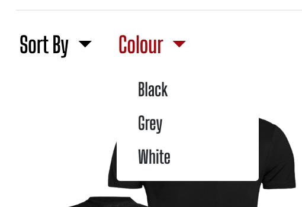
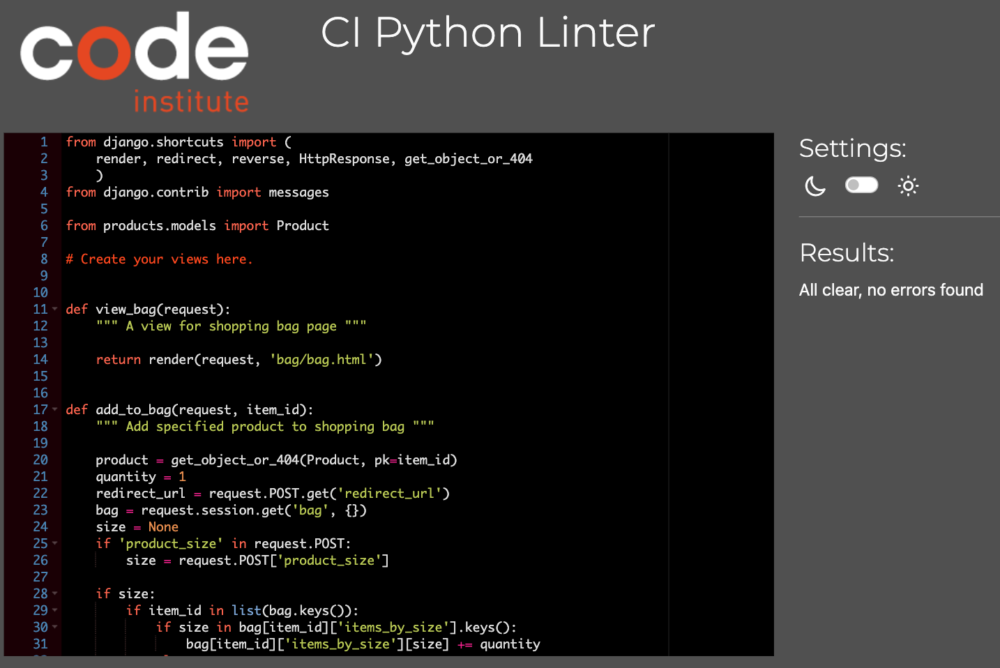
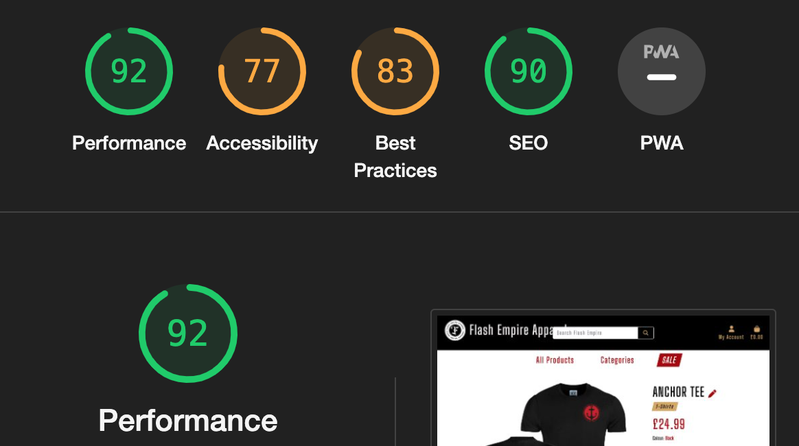

# Flash Empire Apparel

<a href="https://flash-empire-apparel.herokuapp.com/">Flash Empire Apparel</a> is a fictional B2C e-commerce store that is designed and created using the <a href="https://www.djangoproject.com/">Django</a> web framework. The site's main purpose is selling tattoo inspired streetwear to online customers. 

## Table of Contents:
- [Business Model](#business-model)
- [User Experience (UX)](#user-experience-ux)
  - [User Stories](#user-stories)
    - [As Admin](#--as-admin)
    - [As Site User / Shopper](#--as-site-user--shopper)
  - [Database Design](#database-design)
  - [Interaction Design](#interaction-design)
  - [Design](#design)
    - [Mockup Diagrams](#--mockup-diagrams)
    - [Colour Palette](#--colour-palette)
    - [Typography](#--typography)
    - [Imagery](#--imagery)
  - [Features](#features)
    - [Header & Navigation](#header--navigation)
    - [The Homepage](#the-homepage)
    - [Register Account](#register-account)
    - [Signing In](#signing-in)
    - [Signing Out](#signing-out)
    - [All Products](#all-products)
    - [Product Detail](#product-detail)
    - [Add Product Review (For registered users)](#add-product-review-for-registered-users)
    - [Wishlist (For registered users)](#wishlist-for-registered-users)
    - [Blog](#blog)
    - [Blog Post Detail](#blog-post-detail)
    - [Users / Shoppers Shopping Bag](#users--shoppers-shopping-bag)
    - [Checkout](#checkout)
    - [Successful Checkout](#successful-checkout)
    - [Add Product (For super users only)](#add-product-for-super-users-only)
    - [Edit Product (For super users only)](#edit-product-for-super-users-only)
    - [Footer](#footer)
    - [Facebook Page](#facebook-page)
    - [Instagram Page](#instagram-page)
    - [My Profile Page (For registered users)](#my-profile-page-for-registered-users)
- [Testing](#testing)
  - [HTML Validation](#html-validation)
  - [CSS Validation](#css-validation)
  - [Python Validation](#python-validation)
  - [Lighthouse Report](#lighthouse-report)
    - [Homepage Lighthouse Report](#homepage-lighthouse-report)
    - [All Products Page Lighthouse Report](#all-products-lighthouse-report)
    - [Product Detail Page Lighthouse Report](#product-detail-lighthouse-report)
    - [Add Product Page Lighthouse Report](#add-product-lighthouse-report)
    - [Edit Product Page Lighthouse Report](#edit-product-lighthouse-report)
    - [Blog Page Lighthouse Report](#blog-lighthouse-report)
    - [Blog Post Detail Page Lighthouse Report](#blog-post-detail-lighthouse-report)
    - [Bag Page Lighthouse Report](#bag-lighthouse-report)
    - [My Profile Page Lighthouse Report](#profile-page-lighthouse-report)
    - [Wishlist Page Lighthouse Report](#wishlist-page-lighthouse-report)

### Business Model

Flash Empire Apparel is a business to consumer (B2C) fashion retailer that sells tattoo inspired streetwear. We sell a range of products including:
- T-shirts
- Sweatshirts
- Joggers
- Headwear
- Bags

## User Experience (UX)

### User stories
#### - As Admin:
<ul>
  <li>As a Site Admin I can add new products to the site so that I can keep customers interested.</li>
  <li>As a Site Admin I can edit products so that I can update products price, name and image.</li>
  <li>As a Site Admin I can remove products from the store so that when stock runs out and/or product isn't selling well I can remove product from the site.</li>
  <li>As a Site Admin I can create a blog post so that I can show site users what our brand/business has been up to.</li>
  <li>As a Site Admin I can edit a posted blog post so that I can alter any spelling mistakes and/or add content, images etc.</li>
  <li>As a Site Admin I can remove a posted blog post so that I can remove any out of date posts.</li>
</ul>

#### - As Site User / Shopper:
<ul>
  <li>As a Site User I can register for an account so that I have a personal account and can view my profile.</li>
  <li>As a Site User I can receive an account registration confirmation Email so that I can verify my account was successfully created.</li>
  <li>As a Site User I can login and logout with ease so that I can access my personal information.</li>
  <li>As a Site User / Shopper I can view a list of all products so that I can select some to purchase.</li>
  <li>As a Site User / Shopper I can sort all products so that I can identify the desired products through category type and price.</li>
  <li>As a Site User / Shopper I can sort products of a certain category type so that I can view products by name and by price.</li>
  <li>As a Site User / Shopper I can search for products so that I can identify exactly what product I'd like to purchase.</li>
  <li>As a Site User I can save delivery information so that going through checkout will be quicker.</li>
  <li>As a Site User / Shopper I can edit items in my basket so that I can change size, quantity and/or remove item(s).</li>
  <li>As a Site User / Shopper I can securely pay for products so that my order is processed.</li>
  <li>As a Site User I can leave a product review so that I can share my opinion on the product and add a rating.</li>
</ul>

### Database Design

Database ERD

### Interaction Design

Super Users & Site Users Accessibility & Functionality Flowchart

### Design
#### - Mockup Diagrams:
Prior to writing any sort of code, I made a few mockup diagrams based on the sites layout. 
Diagrams were created using [Wireframe.cc](https://wireframe.cc/)

Homepage Mockup Diagram

All Products Page Mockup Diagram

Product Detail Page Mockup Diagram

Blog Page Mockup Diagram

Blog Post Detail Page Mockup Diagram

#### - Colour Palette:
  
The colour scheme is quite powerful and attractive to the user. The palette consists of black, dark red, earth yellow and white.  All four colours create a strong yet vulnerable combination. I wanted colours that represented the name of the brand, Flash Empire, as much as possible. The black and dark red are seen as strong and powerful (Empire), the earth yellow is almost like a gold that represents royalty, wealth (Empire) and the white is used to create a sense of light (Flash) and vulnerability.

#### - Typography:

The font used throughout the site is 'Big Shoulder Display' from [Google Fonts](https://fonts.google.com/) with 'cursive' as the fallback font if the google font fails to load correctly. 
I wanted a font that represented the brands name and 'Big Shoulders Display' does exactly that. It is bold and strong, especially using the 600 weight, these attributes makes it an appealling font for the user.

#### - Imagery:
In e-commerce, imagery is very important. Not just product images, but background images, brand banners and brand logos. And the quality of these images is equally as important. 
I used [Vistaprint](https://www.vistaprint.co.uk/) product design to upload, royalty free, vector images from [Vecteezy](https://www.vecteezy.com/) onto clothing templates to create my product images. I got the brand logo design from [Smashing Logo](https://smashinglogo.com/en/). I edited, modified all images using [Pixelmator](https://www.pixelmator.com/pro/).

  
Background Hero Image

  
  

  
Mobile Background Hero Image

  
  

  
Brand Logo

  
  

  
Brand Banner

  
  

### Features 
#### Header & Navigation:

The header contains:
- Brand logo and name
- Product search input so the shoppers can search for a specific product
- Account dropdown menu so Site Users can view profile, order history and wishlist. If user is superuser a product management option is available, where admin can add, edit or delete products. Also displays user's username. 
  - 

      
Site User Account Dropdown

  
    
    

   - 

      
Super User Account Dropdown

  
     
    

 - User's shopping bag, where users/shoppers can view what they've added to their bag.
 
The navigation contains:
- All products link, takes the user to all products page.
- Categories dropwdown menu, gives the user the ability to filter products via their category.
  - 

      
Categories Dropdown

  
     
      

- Sale link, takes users/shoppers to the stores discounted product.

#### The Homepage:

The homepage contains:
- Background hero image.
- A short tagline summary of what the site offers.
- A shop now link, takes users/shoppers to all products page.

#### Register Account:

Shoppers can register an account which will enable them access to further features such as profile details, order history and wishlist.

  
Verify User's Email

  
  

#### Signing In:

#### Signing Out:

#### All Products:

The all products page contains:
- All products page description.
- Products sort by and colour filter feature (as annotated). Sorts product by name (ascending, descending), users selected choice changes red when clicked. Filters products via product colour.
  - 

      
Sort By Dropdown

  
    
    

   - 

      
Colour Dropdown

  
     
     

- Product count, total number of products available (as annotated).
- Back to top button, when user scrolls down page a 'BTT' button appears and when clicked take users back to top of page (as annotated).
- Wishlist button, for adding products to registered users wishlist, visible within the product card (see below).
- Edit product button, when signed in as Site Admin, super user, a edit product button is displayed within the product card.
   - 

      
Product Card with Edit Button (for super user only) & Wishlist button

  
     
     

#### Product Detail:

The product detail page contains:
- product image (as annotated).
- Product name and category, which is also a link to the specified category page (as annotated).
- Product price (as annotated).
- Product colour (as annotated).
- Product description, a brief description of the product and it's features (as annotated).
- Size selector, where users/shoppers can select their desired size (as annotated).
- Add to Bag button, add product to users/shoppers shopping bag (as annotated).
  - 

      
Add to bag alert

  
     
     

- Add to wishlist button, if users are registered they can add products to a wishlist (as annotated).
- Product reviews, can be viewed just underneath the product image.
- Review Product button, when users are signed in a 'Review Product' button is visible (see below).
  - 

      
Review section

  
     
     

  - 

      
Review section for registered users

  
     
     

     
#### Add Product Review (For registered users):

The add product review page contains:
- Name of product the users are reviewing.
- Review form, for users to add their comments and product rating.
- Add Review button, posts the users review to the reviewed product detail page.
- Cancel button, for when the users want to cancel the operation, returns back to homepage. 

#### Wishlist (For registered users):

The wishlist page contains:
- Product image, image of the wished product which is also a link to the product detail page.
- Product name.
- Product SKU.
- Product Price.
- Date added (d/m/y), the date the user added the wished item to their wishlist.
  - 

      
Added to wishlist alert

  
     
     

- Remove button, removes the chosen wished item from users wishlist.
  - 

      
Removed form wishlist alert

  
     
     

- Keep shopping link, positioned at the bottom of the wishlist page, takes users to all products page.

If users wishlist is empty.

When non-registered users click on the 'add to wishlist' button, they are taken to the sign in page and are prompted by an alert to sign in or sign up.

#### Blog:
Blog page for users/shoppers:

The blog page for users/shoppers contains:
- Blog post featured image, also a link to the post detail page.
- Blog post title, also a link to the post detail page.
- Post created on date.

Blog page for super users:

The blog page for super users additional features:
- Edit blog post button, allows admin to edit blog post (as annotated above).
- Add blog post button, allows admin to add new blog post (as annotated above).

#### Blog Post Detail:

The blog post detail page contains:
- Blog post title.
- Blog post author, the admins username.
- Created on date, the date the post was created.
- Blog post featured image.
- Post content.

#### Users / Shoppers Shopping Bag:

The shopping bag page contains:
- Product info, includes product name, shoppers desired product size and sku.
- Product individual price.
- Product quantity, user can also update quantity from the shopping bag page using the minus and plus buttons.
- Order subtotal, the total price of one product.
- Remove from bag button, using [Font Awesome](https://fontawesome.com/) trash can icon, users can remove items from their bag when selected.
  - 

      
Removed from shopping bag alert

  
     
     

- Bag total, the total of the users/shoppers shopping bag, excluding delivery.
- Delivery info, delivery charge.
- Total, order grand total, including delivery.
- Secure checkout button, takes shoppers to the checkout page to continue with their purchase.
- Keep shopping link, takes users back to all products page.  

#### Checkout:

The checkout page contains:
- Customer information form, includes shoppers details.
- Delivery details form, includes shoppers delivery information.
- A save info checkbox, users can save all details to make future checkout processes alot quicker.
- [Stripe](https://stripe.com/gb) payment input, for shoppers payment method.
- The shoppers bag, displayed to the right of the customer info form, includes the shoppers bag and it's contents details.
- Order subtotal and total, the amount the shopper will be charged.
- Complete payment button, completes the shoppers order process.

#### Successful Checkout:

The successful checkout page contains:
- Thank you message from Flash Empire Apparel, assuring the shopper that their order has been received.
- Order no.
- Order date, the date of purchase.
- Order Details, includes delivery info and billing info.
- The shoppers purchases and product details.
- Keep shopping button, takes shoppers to all products page.
- Order successful alert (visible in the top right of the window), when the order has successfully been processed.

#### Add Product (For super users only):

The add product page contains:
- Add product form, super users fill out this form with new product details.
- Select image button, allows admin users to upload new product image.
- Add product, adds the new product to the database and store.
- Cancel button, cancels the add new product operation, returns to homepage.

#### Edit Product (For super users only):

The edit product page contains:
- Pre-filled product form with current product details.
- Current product image, which can be removed via the remove checkbox.
- Select image button, allows admin users to upload new product image.
- Update product button, successfully updates products details.
- Remove product button, removes product from the store.
- Cancel button, cancels the edit product operation, returns back to homepage.
- Editing product info alert, when editing a product an alert is displayed in the top right corner telling the user what product they are editing.
  - 

      
Editing product info alert

  
     
     

     
#### Footer:

The footer contains:
- Brand logo banner, which is also a homepage link.
- A brief company description.
- Shop links, links to individual product categories.
- Social section, links to Flash Empire's [Facebook](https://www.facebook.com/) and [Instagram](https://www.instagram.com/) pages.
- Community section, contains a link to the blog page.
- [Mail Chimp](https://mailchimp.com/en-gb/?currency=GBP) subscribe newsletter email input, allows users to subscribe to Flash Empire Apparel's newsletter.
- Copyright details.

#### Facebook Page:
[Flash Empire Apparel Facebook Page](https://www.facebook.com/people/Flash-Empire-Apparel/100090384290266/)

#### Instagram Page:
[Flash Empire Apparel Instagram Pofile](https://www.instagram.com/flashempireapparel/)

#### My Profile Page (For registered users):

The my profile page contains:
- The user's saved delivery information.
- The user's order history, contains the order number, date of purchase, purchased items and order total.
- Update profile button, for when the user modifies their delivery information, when clicked will update their details.

## Testing
### HTML Validation
I used [W3C Markup Validation Service](https://validator.w3.org/) to test all HTML files.

| File | Result | Test Screenshot |
| ---- | ------ | ----------------|
| bag/templates/bag/bag.html | Pass |  |
| blog/templates/blog/blog.html | Pass |  |
| blog/templates/blog/blog-post-detail.html | Pass | |
| checkout/templates/checkout/checkout.html | Pass |  |
| checkout/templates/checkout/checkout_success.html | Pass |  |
| home/templates/home/index.html | Pass |  |
| templates/allauth/account/login.html | Pass |  |
| templates/allauth/account/logout.html | Pass |  |
| templates/allauth/account/signup.html | Pass |  |
| profiles/templates/profile/profile.html | Pass |  |
| products/templates/products/edit_product.html | Pass |  |
| products/templates/products/add_product.html | Pass |  |
| products/templates/products/add_review.html | Pass |  |
| products/templates/products/products.html | Pass |  |
| products/templates/products/add_review.html | Pass |  |
| wishlist/templates/wishlist/wishlist.html | Pass |  |

### CSS Validation
I used [W3C Markup Validation Service](https://validator.w3.org/) to test all CSS files via direct input.
| File | Result | Test Screenshot |
| ---- | ------ | --------------- |
| static/css/base.css | Pass (8 Warnings) |  |
| checkout/static/css/checkout.css | Pass (1 Warning) |  |
| profiles/static/css/profile.css | Pass |  |

### JS Validation
I used [jshint](https://jshint.com/) to test all JS files via direct input.
| File | Result | Test Screenshot |
| ---- | ------ | --------------- |
| products/templates/products/products.html (Bottom of file) | No Errors |  |
| profiles/static/js/countryfield.js | No Errors (1 Warning) |  |
| products/templates/products/add_product.html (Bottom of file) | No Errors (1 Warning) |  |
| bag/templates/bag/includes/quantity-input-script.html | No Errors (3 Warnings)|  |
| bag/templates/bag/bag.html (Bottom of file) | No Erros (1 Warning) |  |

### Python Validation
I used [Code Institute's Python Linter](https://pep8ci.herokuapp.com/) to lint my Python code.
| File | Result | Test Screenshot |
| ---- | ------ | --------------- |
| bag/apps.py | No Errors |  |
| bag/templatetags/bag_tools.py | No Errors |  |
| bag/contexts.py | No Errors |  | 
| bag/urls.py | No Errors |  |
| bag/views.py | No Errors |  |
| blog/admin.py | No Errors |  |
| blog/forms.py | No Errors |  |
| blog/models.py | No Errors |  |
| blog/views.py | No Errors |  |
| checkout/forms.py | No Errors |  |
| checkout/models.py | 1 Error |  |
| checkout/signals.py | No Errors |  |
| checkout/views.py | No Errors |  |
| checkout/webhook_handler.py | 2 Errors |  |
| checkout/webhooks.py | 1 Error |  |
| flash_empire_apparel/urls.py | No Errors |  |
| products/admin.py | No Errors |  |
| products/forms.py | No Errors |  |
| products/models.py | No Errors |  |
| products/views.py | No Errors |  |
| wishlist/models.py | No Errors |  |
| wishlist/views.py | No Errors |  |

### Lighthouse Report 
I used [Google Chrome DevTools Lighthouse](https://developer.chrome.com/docs/lighthouse/overview/) was used to test performance, accessibility, best practises and SEO of selected pages.

#### Homepage Lighthouse Report:
   

   
Test Screenshot

  
   
   

#### All Products Lighthouse Report:
   

   
Test Screenshot

  
   
   

#### Product Detail Lighthouse Report:
   

   
Test Screenshot

  
   
   

   
#### Add Product Lighthouse Report:
   

   
Test Screenshot

  
   
   

   
#### Edit Product Lighthouse Report:
   

   
Test Screenshot

  
   
   

#### Blog Lighthouse Report:
   

   
Test Screenshot

  
   
   

   
#### Blog Post Detail Lighthouse Report:
   

   
Test Screenshot

  
   
   

#### Bag Lighthouse Report:
   

   
Test Screenshot

  
   
   

   
#### Profile Page Lighthouse Report:
   

   
Test Screenshot

  
   
   

   
#### Wishlist Page Lighthouse Report:
   

   
Test Screenshot

  
   
   

   

The site is fully responsive on most handheld and desktop devices.

### Messages / Toasts:
<ul>
  <li>Added meassages/toasts to indicate a successful operation. For example, when a shopper adds an item to their bag, or edits their shopping bag a pop-up message appears indicating the users operation and their details.</li>
  <li>Other messages/toasts include errors, info and warnings. These occur when the user/shopper searches for a product that isn't recognised or when their payment is unsuccessfull.</li>
</ul>
(Successfull message.)

(Info Alert)

## Features For The Future
<ul>
  <li>Add a remove review feature when signed in as admin</li>
  <ul>
    <li>This allows the admin control over all customer reviews and can remove them if any explicit content is used.</li>
    <li>Creates a more safe environment for the user.</li>
  </ul>
  <li>Image Carousel</li>
  <ul>
    <li>Add a bootstrap carousel to product detail images. This allows the opportunity to really show off the products and their details.</li>
  </ul>
</ul>

## Testing

### Device Testing:
<ul>
  <li>Tested the application on several different devices, such as iPhone (11, SE), iPad air and Google nest hub (2nd gen).</li>
  <li>No bugs or errors returned when testing on these devices.</li>
</ul>

### Browser Testing:
<ul>
  <li>No bugs or errors occurred when testing on the following browsers:</li>
  <ul>
    <li>Google Chrome</li>
    <li>Firefox</li>
    <li>Safari</li>
  </ul>
</ul>

### Lighthouse Validator Results:
<ul>
  <li>Homepage Results:
  </li>
   
  <li>All Product Page Results:
  </li>
   
  <li>Product Detail Page Results:
  </li>
</ul>

### Bugs & Errors:
<ul>
  <li>Adjust Product Quantity:</li>
  <ul>
    <li>When editing shopping bag I noticed, when adjusting product quantity, you could only adjust the latest product added quantity. 
    Think this maybe a Javascript glitch?</li>
    
  </ul>
  <li>Value too long error:
    <ul>
      <li>One error I came up against was this 'value too long' error (as seen below). 
      I overcame this error by removing my database and creating new one.</li>
      
       
    </ul>
  </li>
  <li>No Media Files:</li>
  <ul>
  <li>Unfortunately, my final deployed site, on <a href="https://www.heroku.com/">Heroku</a>, does not have any media files. This includes all product           files.  Tried to overcome this by altering the AWS media path but unfortunately no luck.</li>
  </ul>
</ul>

## Technologies Used:

### Languages Used:
<ul>
  <li><a href="https://en.wikipedia.org/wiki/HTML5">HTML5</a></li>
  <li><a href="https://en.wikipedia.org/wiki/CSS">CSS3</a></li>
  <li><a href="https://en.wikipedia.org/wiki/JavaScript">Javascript</a></li>
  <li><a href="https://en.wikipedia.org/wiki/Python_(programming_language)">Python</a></li>
</ul>

### Frameworks, Libraries and Programs Used:
<ul>
  <li><a href="https://fonts.google.com/">Google Fonts</a></li>
  <ul>
    <li>Google fonts was used to import the '' font.</li>
  </ul>
    <li><a href="https://fontawesome.com/">FontAwesome</a></li>
  <ul>
    <li>Fontawesome was used to add icons to several elements.</li>
  </ul>
    <li><a href="https://git-scm.com/">Git</a></li>
  <ul>
    <li>Git was used for version control and using the Gitpod terminal to commit and push to GitHub.</li>
  </ul>
  <li><a href="https://github.com/">GitHub</a></li>
    <ul>
    <li>GitHub is used to store the projects code after being pushed from Git.</li>
  </ul>
  <li><a href="https://www.pixelmator.com/pro/">Pixelmator</a></li>
  <ul>
    <li>I used Pixelmator to edit logo, homepage image and product images.</li>
  </ul>
  <li><a href="https://getbootstrap.com/docs/4.3/getting-started/introduction/">Bootstrap4</a></li>
  <ul>
    <li>Bootstrap framework is used for styling, structuring and reponsive development.</li>
  </ul>
  <li><a href="https://en.wikipedia.org/wiki/JQuery">jQuery</a></li>
  <ul>
    <li>jQuery is a fast, small, and feature-rich JavaScript library. It makes things like HTML document traversal and manipulation, event handling and       animation much simpler with an easy-to-use API that works across a multitude of browsers.</li>
  </ul>
    <li><a href="https://www.djangoproject.com/">Django</a></li>
  <ul>
    <li>Django framework was used to create the app/project.</li>
  </ul>
    <li><a href="https://en.wikipedia.org/wiki/Stripe,_Inc.">Stripe</a></li>
  <ul>
    <li>Stripe was used for the payment process integration.</li>
  </ul>
    <li><a href="https://www.heroku.com/">Heroku</a></li>
  <ul>
    <li>Heroku is used for creating my app.</li>
  </ul>
    <li><a href="https://aws.amazon.com/">AWS</a></li>
  <ul>
    <li>AWS is used for storing my static and media files.</li>
  </ul>
</ul>

## Credits:

### Code:
<ul>
  <li>The hover underline effect is from <a href="30secondsofcode.org/css/s/hover-underline-animation/">30secondsofcode.org</a>.</li>
  <li>The slanted div effect is from <a href="html-css-js.com/css/generator/transform/">html-css-js.com</a>.</li>
  <li>I gathered my colour palette from <a href="https://coolors.co">html-css-js.com</a>.</li>
  <li>I followed the <a href="https://codeinstitute.net/">Code Institutes</a> walkthrough project 'Boutique Ado'. This project was a big help, especially,    with the stripe payment backend code.</li>
  <li>The colour filter code was from <a href="https://www.youtube.com/watch?v=exN6RdC_xbE">Youtube</a>.</li>
  <li>I occasionally referenced to <a href="https://stackoverflow.com/">StackOverFlow</a> to overcome any issues.</li>
  
</ul>

### Media:
<ul>
  <li>The logo and branding are from <a href="https://smashinglogo.com/en/">smashinglogo</a>.</li>
  <li>The product graphic print designs are from <a href="https://www.vecteezy.com/">Vecteezy.com</a></li>
  <li>The clothing product images are from <a href="https://www.vistaprint.co.uk/">VistaPrint</a>. 
  I used their upload design feature to add the my graphic print designs onto their apparel products, and print screened the resulting images.</li>
</ul>
